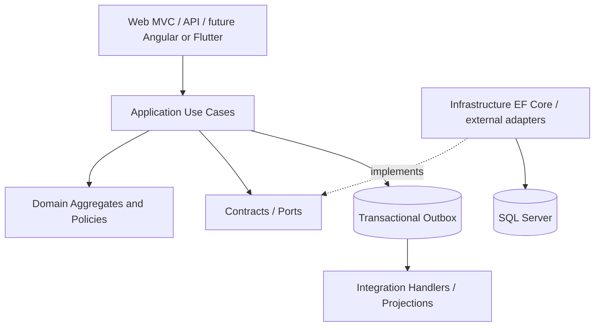

# 00 — System Charter / ميثاق النظام

## Purpose
Build a modular, auditable ERP supporting sales, procurement, stock, accounting, POS, manufacturing, CRM, HR, projects, services and commerce. Functional correctness, financial traceability and backwards compatibility outrank speed of feature delivery.

## Architecture decisions (proposed)
- **Modular monolith first**: ASP.NET Core / C# / EF Core / SQL Server; bounded contexts separated by domain/application/infrastructure boundaries. Microservices only after measured need.
- DDD aggregates for transactional invariants; explicit DTO mapping (no AutoMapper by default); dependency injection; application use cases; unit-of-work transaction boundary.
- Each context **owns its write model**. Other contexts reference IDs, call contracts or consume events; they never mutate another context's tables directly.
- Shared Kernel must be tiny: EntityId, CompanyId, Money, CurrencyCode, DateRange, DomainEvent and immutable value objects. Do not create a god `CommonService`.
- Integration events are facts in past tense; commands express intent. Events do not substitute for authorization or domain validation.
- **Ledger is authoritative for financial balances**; stock movement ledger is authoritative for physical stock; operational documents are the evidence/source, not independently edited balances.
- Posting is immutable. Correct posted records using authorized reversals, credit notes and adjustment documents with links to originals.
- Default to strict consistency for document posting + local outbox; eventual consistency for notifications, dashboards, search and noncritical projections.
- Tenant/company segregation applies to every transactional aggregate, query, command, event and authorization policy.

## Nonnegotiable invariants
1. One business action has at most one effective posting per document/version/operation type.
2. No negative stock unless explicitly allowed by company/product/location policy; reservation cannot exceed available-to-promise.
3. Debit = credit per journal entry in base currency, with explicit rounding tolerance policy.
4. No cross-company reference unless an approved intercompany workflow establishes mirrored documents.
5. A posted document cannot be edited in ways that alter its financial or inventory effect.
6. Monetary calculations use decimal, explicit rounding and currency precision; never binary floating point.
7. Permissions checked server-side; UI hiding is not authorization.
8. Every externally visible sequence is unique within its declared scope and document type.
9. All external callbacks, event handlers and background jobs are replay-safe.
10. Migration must preserve historic records, IDs, references and audit trails.

## Architecture layers

## Consistency policy
- Atomic within one SQL database transaction: document status + owned ledger lines + outbox row when local and participating in same transaction.
- Across bounded contexts: explicit orchestrated process or event handlers with retries, idempotency and compensation; **do not claim distributed atomicity**.
- No network call inside long-running database transactions.
- Always define who can retry, how errors are observed, and how operators reconcile incomplete processes.

## Versioning and conventions
- Domain IDs immutable; database foreign keys inside owner schema; cross-context references use stable IDs plus validation contract, not uncontrolled cascades.
- Every document includes CompanyId, CreatedAtUtc, CreatedBy, Status, RowVersion, source references and audit metadata.
- DocumentNumber is a presentation/business key, never the primary key.
- Prefer UTC timestamps; capture local business date, time zone and posting period separately.
- Configuration belongs to the responsible context and is versioned/effective-dated where it impacts history.
