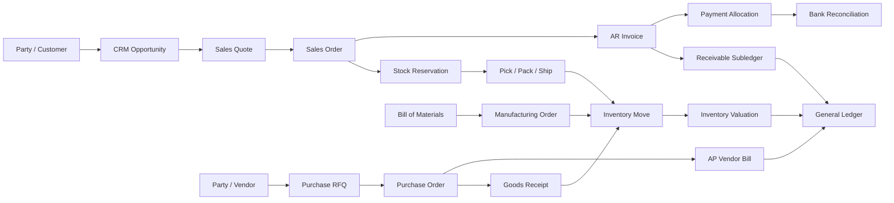

# 01 — Module and Dependency Map / خريطة الوحدات

## Legend
`A --> B` means **A depends on a published contract of B**. It does not grant direct database write access. Dashed edges in process diagrams indicate async events/projections.

## Context catalog
| Context | Owns | Reads/contracts from | Publishes to |
|---|---|---|---|
| Identity & Access | users, roles, permission grants, sessions | Organization | all command gates, audit |
| Organization | companies, branches, fiscal/business settings | Identity | all |
| Parties | parties, customers, vendors, addresses, contacts | Organization | CRM, Sales, Purchase, Finance |
| Catalog | products, variants, units, categories, attributes | Organization, Tax policy | Sales, Purchase, Inventory, MFG, POS |
| Pricing | price lists, discount policies, promotions | Catalog, Parties, Currency | Sales, POS, Commerce |
| CRM | leads, opportunities, pipeline, activities | Parties, Identity | Sales |
| Sales | quotes, sales orders, returns requests | Parties, Catalog, Pricing, Credit, Tax | Inventory, Billing, CRM |
| Procurement | RFQs, purchase orders, vendor agreements | Parties, Catalog, Tax | Inventory, AP |
| Inventory | warehouses, bins, lots, serials, reservations, stock moves, counts | Catalog, Organization | Sales, Purchase, MFG, Costing |
| Fulfillment | picking, packing, delivery, carriers | Sales, Inventory | Billing, Customer notifications |
| Manufacturing | BOM, routings, work orders, consumption, output | Catalog, Inventory, Quality | Inventory, Costing |
| Quality | checks, inspections, nonconformities | Inventory, MFG | Release/hold decisions |
| Maintenance | equipment, service plans, work requests | Organization, HR | MFG scheduling |
| Billing / AR / AP | invoices, credit notes, bills, payment allocations | Sales, Purchase, Parties, Tax, Finance | Accounting |
| Accounting / GL | chart, journals, entries, periods, cost centers | Organization, Currency, Tax | reports |
| Treasury | cash, banks, bank reconciliation, payment execution | Accounting, AR/AP | Accounting |
| Tax | tax rules, effective rates, jurisdictions | Organization, Catalog | pricing, billing, GL |
| Fixed Assets | assets, depreciation, disposal | Accounting, Procurement | Accounting |
| POS | sessions, tills, receipts, refunds | Catalog, Pricing, Inventory, Billing | Accounting, Inventory |
| Commerce | carts, checkout, web orders, customer portal | Catalog, Pricing, Sales, Payment | Sales |
| Subscriptions & Rental | recurring contracts, billing schedules, rental assets | Parties, Catalog, Sales, Billing | Billing, Inventory |
| Projects & Timesheets | projects, tasks, time entries, milestones | Parties, HR, Sales | Billing, Costing |
| Helpdesk & Field Service | tickets, service orders, visits | Parties, Projects, Inventory | Billing |
| HR & Payroll | employees, attendance, leave, payroll runs | Organization, Identity, Projects | Accounting |
| Marketing | campaigns, audiences, consent, attribution | Parties, CRM | CRM, Commerce |
| Documents & Approvals | files, templates, approval requests | Identity, Organization | workflows |
| Reporting & BI | read models, snapshots, KPIs | published events/read APIs | users |
| Integration & Automation | external mappings, outbox/inbox, jobs | published contracts | external systems |
| Platform | numbering, audit, localization, feature flags, notifications | Organization, Identity | all |

## Dependency layers
```mermaid
flowchart TD
 subgraph Foundation
 O[Organization] --> I[Identity & Access]
 P[Parties] --> O
 C[Catalog] --> O
 X[Currency / Tax / Numbering / Audit] --> O
 end
 subgraph Commercial
 CRM[CRM] --> P
 PR[Pricing] --> C
 S[Sales] --> CRM
 S --> PR
 S --> P
 B[Billing AR/AP] --> S
 PO[Procurement] --> P
 PO --> C
 end
 subgraph Operations
 INV[Inventory] --> C
 F[Fulfillment] --> INV
 F --> S
 M[Manufacturing] --> INV
 Q[Quality] --> INV
 POS[POS] --> PR
 POS --> INV
 EC[eCommerce] --> S
 end
 subgraph Finance
 GL[General Ledger] --> O
 B --> GL
 TR[Treasury] --> GL
 FA[Fixed Assets] --> GL
 end
 PO --> B
 F --> B
 M --> GL
 POS --> B
 HR[HR / Payroll] --> GL
 PROJ[Projects / Services] --> B
 R[Reporting] -.reads projections.-> GL
 R -.reads projections.-> INV
 end
```
**Note:** Diagram shows a conceptual dependency, not a requirement to import one module's implementation. Some connections should be integration contracts or orchestration, avoiding dependency cycles (e.g., Billing ↔ Sales).

## Explicit forbidden coupling
- Sales **must not** update ProductStock, JournalEntry, Invoice tables directly.
- Procurement **must not** insert StockMovement or vendor ledger entries directly.
- Inventory **must not** compute customer receivable balances.
- POS **must not** bypass sales/inventory/accounting posting invariants.
- HR **must not** write journal lines; Payroll publishes an approved posting request.
- Reporting **must not** become a second source of truth or issue writes into operational schemas.
- Shared kernel **must not** contain product, customer, invoice or warehouse aggregate entities.

## Cross-module relationship graph


## Multi-company scope
Every context declares whether its data is: `GlobalReference`, `TenantScoped`, `CompanyScoped`, `BranchScoped`, or `DocumentScoped`. Company access is verified at query and command boundaries. Shared customers/products across companies require explicit visibility and company-specific pricing/tax/account mappings.
