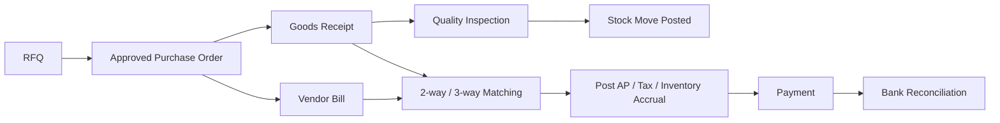

# 03 — Workflows, State Machines and Posting

## Shared document rules
Each aggregate defines statuses, allowed commands, guards, approvers, side effects, idempotency key and reversal. Status labels are not interchangeable between modules. Never infer a posted event merely from `Status=Approved`.

## Order-to-Cash (O2C)

```mermaid
flowchart LR
 A[Lead] --> B[Quote Draft]
 B --> C[Quote Sent / Accepted]
 C --> D[Sales Order Confirmed]
 D --> E[Credit / Availability Check]
 E --> F[Reserve]
 F --> G[Pick Pack Deliver]
 G --> H[Posted Stock Move]
 D --> I[Invoice Draft]
 H --> I
 I --> J[Invoice Posted]
 J --> K[AR + Revenue + Tax Journal]
 K --> L[Receive Payment]
 L --> M[Allocate / Reconcile]
```

**Branch policies:** invoicing may occur on ordered quantities, delivered quantities, milestones or subscriptions; the company policy determines the trigger. Partial shipment, partial invoice, backorder and overpayment must be representable.

| Action | Owner | Preconditions | Side effects | Undo/correction |
|---|---|---|---|---|
| Confirm order | Sales | active customer, valid prices/taxes | freeze order commercial snapshot, request availability | cancel unfulfilled remainder |
| Reserve stock | Inventory | allowed stock, no duplicate reservation | increase reserved projection | release reservation |
| Deliver | Fulfillment + Inventory | picked quantities valid, no over-delivery without policy | post stock move, release reservation, record cost event | return receipt + valuation reversal |
| Post invoice | Billing | tax/date/period validation, unbilled quantities | AR/GL posting request | credit note, not delete |
| Receive payment | Treasury | valid bank/cash method | cash/bank and unapplied receipt | authorized reversal |
| Allocate payment | Treasury/AR | open amount, same company/currency rules | reduce outstanding invoice | unallocate/reallocate |

## Procure-to-Pay (P2P)

- Two-way matching: PO vs bill; three-way: PO vs receipt vs bill. Price/quantity tolerances configurable.
- Goods receipt and vendor bill can arrive in either order; support GRNI (goods received not invoiced) / accrual clearing if perpetual inventory accounting is enabled.
- Partial receipt, rejection, replacement, return to vendor, landed costs and purchase price variance are separate events/documents.

## Inventory movement
States: `Draft -> Ready -> Reserved(optional) -> InProgress -> Posted`; alternative `Cancelled`, `Failed/NeedsReview`. Transfer between warehouses may use two-step/three-step locations. Posting must produce **balanced quantity movement** source-to-destination, with explicit virtual locations for supplier, customer, scrap, production and inventory adjustment. Internal transfers usually do not create revenue/expense; accounting depends on ownership and valuation policies.

## Manufacturing
`Draft -> Planned -> Released -> InProgress -> Completed -> Closed` with Cancel/Hold where legal. BOM versions effective-dated; consume raw materials, record scrap/byproducts, receive finished goods, calculate WIP and variance; lot/serial traceability both directions. A repeated ingredient is legal (e.g., cheese 20g added at two different operations).

## POS
`OpenSession -> Orders/Payments/Returns -> CashCount -> CloseSession -> Settlement/Posting`. Offline retries must use stable order IDs; cashier session close must not repost every receipt. Cash difference is an explicit approved adjustment.

## Returns and corrections
- Customer return: return authorization -> goods receipt -> inspect -> restock/scrap -> credit note/refund as approved.
- Vendor return: authorization -> outbound stock movement -> vendor credit note / debit adjustment.
- Manufacturing correction: controlled scrap/rework/reversal, not deletion of consumption.
- Posted GL correction: reversing journal entry + replacement if needed; lock dates enforced.

## HR and services
- Payroll: attendance/leave/contract snapshots -> calculation -> approval -> payroll posting -> payout; payroll re-run must not duplicate GL entries.
- Project: time entry -> approval -> billable quantity -> invoice; rejected time cannot be billed.
- Subscription: renewal scheduler -> unique period invoice -> payment status -> suspend/renew; rerunning scheduler is idempotent.
- Rental: reserve asset -> handover -> billing -> return -> condition assessment -> deposit settlement.

## Failure paths and saga checkpoints
For each cross-module workflow persist `ProcessId`, `CorrelationId`, `CurrentStep`, `RetryCount`, `LastError`, `CompensationStatus`. Example delivery success + invoice failure must remain visible and retryable, **not silently rollback a real-world shipment**. Compensation requires an actual authorized business document when physical or financial posting occurred.
